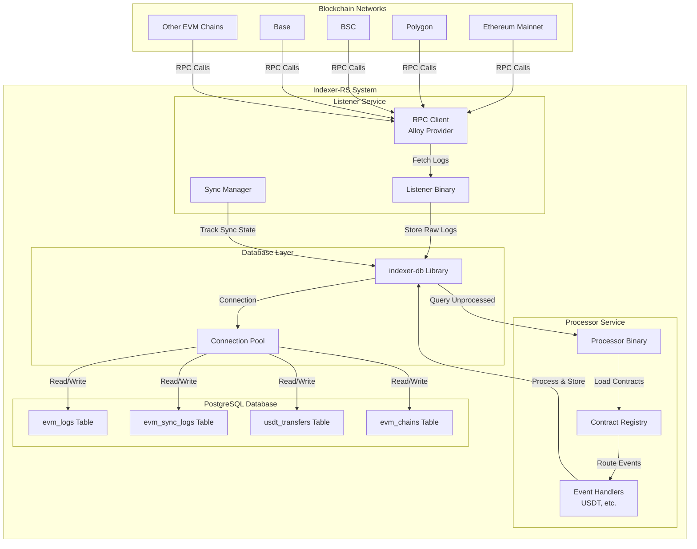
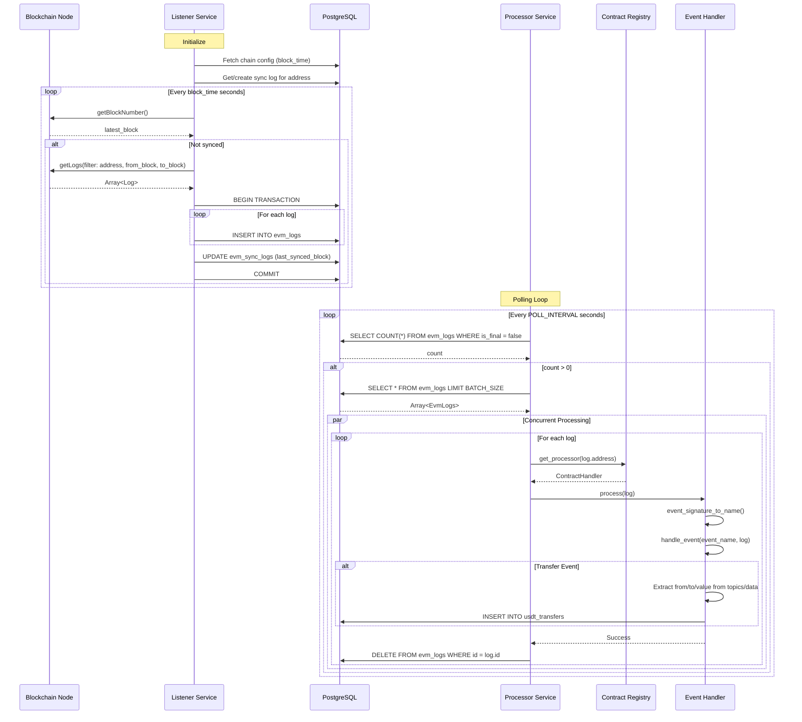
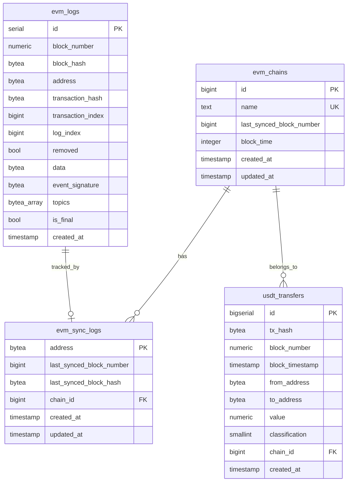
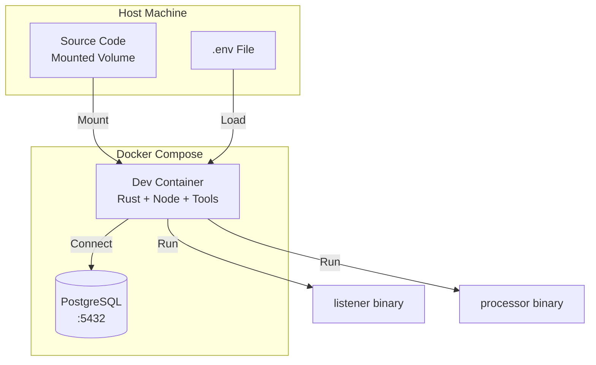
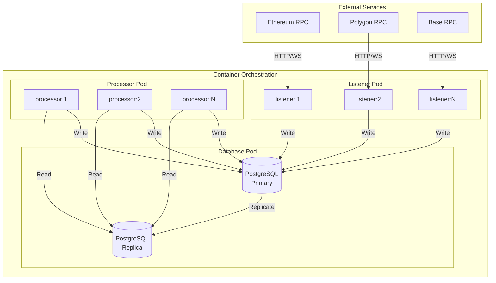

# Indexer-RS Architecture Documentation

## Table of Contents
1. [System Overview](#system-overview)
2. [High-Level Architecture](#high-level-architecture)
3. [Component Architecture](#component-architecture)
4. [Data Flow](#data-flow)
5. [Database Schema](#database-schema)
6. [Technology Stack](#technology-stack)
7. [Deployment Architecture](#deployment-architecture)
8. [Error Handling](#error-handling)
9. [Configuration Management](#configuration-management)
10. [Development Workflow](#development-workflow)

---

## System Overview

**Indexer-RS** is a production-ready, high-performance blockchain event indexing system built in Rust. It monitors and indexes events from EVM-compatible blockchain networks (Ethereum, Polygon, BSC, Base, etc.) with a focus on reliability, scalability, and maintainability.

### Core Purpose
- **Real-time Event Monitoring**: Continuously monitors smart contract events from multiple addresses
- **Event Indexing**: Stores raw blockchain events in a structured database
- **Event Processing**: Processes indexed events with custom business logic (e.g., USDT transfer tracking)
- **Multi-Chain Support**: Supports any EVM-compatible blockchain network

### Key Characteristics
- **Modular Design**: Three independent components (listener, processor, database library)
- **Type-Safe**: Leverages Rust's type system and SQLx for compile-time query verification
- **Concurrent Processing**: Uses Tokio async runtime for high-throughput event processing
- **Fault Tolerant**: Graceful error handling, retry mechanisms, and transaction safety
- **Production Ready**: Docker support, database migrations, connection pooling

---

## High-Level Architecture



---

## Component Architecture

### 1. Database Library (`libs/indexer-db`)

**Purpose**: Centralized database access layer providing type-safe database operations.

**Location**: `libs/indexer-db/`

**Structure**:
```
libs/indexer-db/
├── src/
│   ├── lib.rs              # Database initialization & connection pooling
│   ├── entity.rs           # Entity module exports
│   └── entity/
│       ├── evm_chains.rs   # Chain configuration entity
│       ├── evm_logs.rs     # Raw EVM event logs entity
│       ├── evm_sync_logs.rs # Sync state tracking entity
│       └── usdt_transfers.rs # Processed USDT transfer entity
└── migrations/             # SQLx database migrations
```

#### Key Functions

**Database Initialization** (`lib.rs`):
- Creates PostgreSQL connection pool
- Configurable max connections (default: 5)
- Environment variable: `DATABASE_MAX_CONNECTIONS`

**Entity Operations**:

1. **EvmChains** (`evm_chains.rs`):
   - `fetch_by_id()`: Retrieve chain configuration by ID
   - `update_last_synced_block_number()`: Update chain sync progress

2. **EvmLogs** (`evm_logs.rs`):
   - `create()`: Insert raw EVM log into database
   - `find_all()`: Fetch unprocessed logs (paginated)
   - `count()`: Count total unprocessed logs
   - `delete()`: Remove processed log
   - `try_into<Log>()`: Convert database entity to Alloy Log type

3. **EvmSyncLogs** (`evm_sync_logs.rs`):
   - `find_by_address()`: Get sync state for contract address
   - `find_or_create_by_address()`: Get or create sync state
   - `create()`: Create new sync tracking record
   - `update_last_synced_block_number()`: Update sync progress

4. **UsdtTransfers** (`usdt_transfers.rs`):
   - `create()`: Insert USDT transfer with conflict handling
   - `fetch_by_id()`: Retrieve transfer by ID

**Database Connection**:
- Uses SQLx with PostgreSQL driver
- Connection string from environment variables:
  - `PGHOST`, `PGPORT`, `PGUSER`, `PGDATABASE`, `PGAPPNAME`
- Connection pooling for efficient resource usage

---

### 2. Listener Service (`listener`)

**Purpose**: Monitors blockchain networks and fetches event logs from smart contracts.

**Location**: `listener/`

**Structure**:
```
listener/
├── src/
│   ├── main.rs        # Entry point, service orchestration
│   ├── service.rs     # ListenerService implementation
│   └── error.rs       # Error types
└── Cargo.toml
```

#### Architecture Details

**Main Entry Point** (`main.rs`):
1. Initializes database connection pool
2. Reads environment variables:
   - `CHAIN_ID`: Blockchain network identifier
   - `CONTRACT_ADDRESSES`: Comma-separated contract addresses
   - `RPC_URL`: Blockchain RPC endpoint
3. Fetches chain configuration from database
4. Creates one `ListenerService` per contract address
5. Applies rate limiting based on chain block time
6. Spawns concurrent tasks for each contract listener

**ListenerService** (`service.rs`):
- Implements Tower `Service` trait for rate limiting
- Rate limit: 1 request per `block_time` seconds (from chain config)
- Each service instance handles one contract address

**Core Function: `fetch_and_save_logs()`**:
1. **Initialize Provider**: Creates Alloy RPC provider
2. **Get Sync State**: Retrieves or creates sync log for address
3. **Check Sync Status**: Compares last synced block with latest block
4. **Determine Block Range**:
   - If `last_synced_block_number == 0`: Find deployment block using binary search
   - Otherwise: Start from `last_synced_block_number + 1`
   - Fetch up to 10 blocks at a time (or until latest block)
5. **Fetch Logs**: Uses Alloy Filter to get logs from RPC
6. **Save to Database**: 
   - Begins database transaction
   - Saves each log to `evm_logs` table
   - Updates sync state with new block number
   - Commits transaction atomically

**Deployment Block Detection** (`find_deployment_block()`):
- Binary search algorithm to find first block where contract code exists
- Efficiently handles contracts deployed at unknown block numbers
- Uses `get_code_at()` RPC call with block number parameter

**Error Handling**:
- RPC errors: Retried on next iteration
- Database errors: Logged and transaction rolled back
- Invalid addresses: Error returned, service continues

**Rate Limiting**:
- Tower middleware: `ServiceBuilder::new().rate_limit(1, Duration::from_secs(block_time))`
- Prevents RPC rate limit violations
- Respects chain-specific block times

---

### 3. Processor Service (`processor`)

**Purpose**: Processes raw EVM logs with contract-specific business logic.

**Location**: `processor/`

**Structure**:
```
processor/
├── src/
│   ├── main.rs              # Entry point, polling loop
│   ├── service.rs           # Log processing orchestration
│   ├── error.rs             # Error types
│   ├── utils.rs             # Utility functions
│   ├── contracts.rs         # Contract registry
│   └── contracts/
│       ├── contract_handler.rs  # ContractHandler trait
│       └── usdt.rs          # USDT ERC20 implementation
├── artifacts/
│   └── abi/                 # Contract ABI JSON files
└── Cargo.toml
```

#### Architecture Details

**Main Entry Point** (`main.rs`):
1. Initializes database connection pool
2. Reads configuration:
   - `POLL_INTERVAL`: Sleep duration between polls (default: 10 seconds)
   - `BATCH_SIZE`: Number of logs to process per batch (default: 25)
   - `CHAIN_ID`: Chain identifier for processed data
3. **Polling Loop**:
   - Counts unprocessed logs in database
   - If logs exist: Calls `process_logs()`
   - If no logs: Sleeps for `POLL_INTERVAL`
   - Handles errors gracefully, continues polling

**Processing Service** (`service.rs`):
1. **Initialize Registry**: Creates `ContractRegistry` from environment
2. **Fetch Batch**: Gets `BATCH_SIZE` unprocessed logs from database
3. **Concurrent Processing**: 
   - Spawns one async task per log
   - Each task:
     - Gets contract handler from registry
     - Processes log with handler
     - Deletes log from database on success
     - Logs errors on failure

**Contract Registry** (`contracts.rs`):
- **Environment Variable**: `CONTRACTS` format: `contract_name:address,contract_name:address`
- **Registry Map**: `HashMap<String, String>` (address -> contract name)
- **Get Processor**: 
  - Converts log address to hex string
  - Looks up contract name in registry
  - Returns appropriate handler implementation

**Contract Handler Trait** (`contracts/contract_handler.rs`):
```rust
pub trait ContractHandler {
    const NAME: &str;
    
    fn new(address: &str) -> Result<Self, AppError>;
    fn abi(&self) -> &JsonAbi;
    fn event_signature_to_name(&self, signature: [u8; 32]) -> Result<String, AppError>;
    fn process(&self, log: EvmLogs, pool: &Pool<Postgres>, chain_id: i64) -> Future<Result<(), AppError>>;
    fn handle_event(&self, event: &str, log: &Log, pool: &Pool<Postgres>, chain_id: i64) -> Future<Result<(), AppError>>;
}
```

**Key Methods**:
- `get_abi_for_contract()`: Loads ABI JSON from `ARTIFACTS_BASE_PATH`
- `event_signature_to_name()`: Maps keccak256 hash to event name from ABI
- `process()`: Main processing pipeline (signature -> name -> handle_event)

**USDT ERC20 Handler** (`contracts/usdt.rs`):
- **Contract Name**: `"usdt_erc20"`
- **Supported Events**: `Transfer`, `Approval`
- **Transfer Processing**:
  1. Extracts `from` and `to` addresses from topics (padded 32-byte values)
  2. Extracts `value` from log data (uint256, big-endian)
  3. Converts U256 to BigDecimal for database storage
  4. Extracts transaction hash, block number, block timestamp
  5. Creates `UsdtTransfers` entity
  6. Inserts into database with conflict handling (ON CONFLICT DO UPDATE)
- **Approval Processing**: Currently logs only (TODO: implement storage)

**Utility Functions** (`utils.rs`):
- `vec_to_hex()`: Converts byte vector to hex string

---

## Data Flow

### Complete Event Processing Pipeline



### Detailed Flow Steps

#### Phase 1: Event Listening (Listener Service)

1. **Initialization**:
   - Database connection pool created
   - Chain configuration loaded from `evm_chains` table
   - One service instance per contract address
   - Rate limiter configured (1 request per block_time seconds)

2. **Sync State Management**:
   - Query `evm_sync_logs` for contract address
   - If not exists: Create with `last_synced_block_number = 0`
   - If exists: Use stored `last_synced_block_number`

3. **Block Range Calculation**:
   - **First Sync** (`last_synced_block_number == 0`):
     - Binary search to find deployment block
     - Start from deployment block
   - **Subsequent Syncs**:
     - Start from `last_synced_block_number + 1`
   - **End Block**:
     - `min(from_block + 9, latest_block)` (fetches 10 blocks at a time)

4. **Log Fetching**:
   - Create Alloy Filter: `Filter::new().address(contract_address).from_block(...).to_block(...)`
   - Call RPC: `provider.get_logs(&filter)`
   - Receive array of `Log` objects

5. **Database Storage**:
   - Begin transaction
   - For each log:
     - Convert Alloy `Log` to `EvmLogs` entity
     - Insert into `evm_logs` table
   - Update `evm_sync_logs.last_synced_block_number`
   - Commit transaction (atomic operation)

#### Phase 2: Event Processing (Processor Service)

1. **Polling**:
   - Query: `SELECT COUNT(*) FROM evm_logs WHERE is_final = false`
   - If count > 0: Proceed to processing
   - If count == 0: Sleep for `POLL_INTERVAL` seconds

2. **Batch Fetching**:
   - Query: `SELECT * FROM evm_logs LIMIT BATCH_SIZE`
   - Retrieve unprocessed logs

3. **Contract Resolution**:
   - Convert log address to hex string
   - Look up in contract registry
   - Get contract handler implementation

4. **Event Processing**:
   - **Signature Resolution**:
     - Extract `event_signature` (first topic, keccak256 hash)
     - Match against ABI events
     - Get event name (e.g., "Transfer")
   - **Event Handling**:
     - Call handler's `handle_event(event_name, log)`
     - Handler extracts event parameters
     - Handler performs business logic
     - Handler stores processed data

5. **Cleanup**:
   - On successful processing: Delete log from `evm_logs` table
   - On error: Log error, keep log for retry

---

## Database Schema

### Entity Relationship Diagram



### Table Definitions

#### 1. `evm_chains`
**Purpose**: Stores blockchain network configurations.

| Column | Type | Constraints | Description |
|--------|------|-------------|-------------|
| `id` | BIGINT | PRIMARY KEY | Chain ID (e.g., 1 for Ethereum, 84532 for Base Sepolia) |
| `name` | TEXT | UNIQUE, NOT NULL | Human-readable chain name |
| `last_synced_block_number` | BIGINT | NULL | Last synced block for chain-level tracking |
| `block_time` | INTEGER | NOT NULL | Average block time in seconds (for rate limiting) |
| `created_at` | TIMESTAMP | NOT NULL, DEFAULT NOW() | Record creation timestamp |
| `updated_at` | TIMESTAMP | NOT NULL, DEFAULT NOW() | Record update timestamp (auto-updated) |

**Indexes**: None (small table, primary key sufficient)

**Triggers**:
- `update_evm_chains_updated_at`: Auto-updates `updated_at` on UPDATE

**Sample Data**:
```sql
INSERT INTO evm_chains (id, name, block_time, last_synced_block_number)
VALUES (1, 'Ethereum Mainnet', 12, 24039923);
```

---

#### 2. `evm_logs`
**Purpose**: Stores raw EVM event logs before processing.

| Column | Type | Constraints | Description |
|--------|------|-------------|-------------|
| `id` | SERIAL | PRIMARY KEY | Auto-incrementing ID |
| `block_number` | NUMERIC | NOT NULL | Block number where log was emitted |
| `block_hash` | BYTEA | NOT NULL | Hash of the block (32 bytes) |
| `address` | BYTEA | NOT NULL | Contract address that emitted the log (20 bytes) |
| `transaction_hash` | BYTEA | NOT NULL | Hash of the transaction (32 bytes) |
| `transaction_index` | BIGINT | NOT NULL | Index of transaction in block |
| `log_index` | BIGINT | NOT NULL | Index of log in transaction |
| `removed` | BOOL | DEFAULT FALSE | Whether log was removed (reorg handling) |
| `data` | BYTEA | NULL | Unindexed event data |
| `event_signature` | BYTEA | NULL | Keccak256 hash of event signature (first topic) |
| `topics` | BYTEA[] | NULL | Array of indexed event parameters (32 bytes each) |
| `is_final` | BOOL | DEFAULT FALSE | Whether log has been processed |
| `created_at` | TIMESTAMP | NOT NULL, DEFAULT NOW() | Record creation timestamp |

**Indexes**:
- `evm_logs_unique_on_transaction_hash_log_index`: UNIQUE constraint on `(transaction_hash, log_index)`

**Table Type**: `UNLOGGED` (PostgreSQL optimization for temporary data)

**Notes**:
- Logs are deleted after successful processing
- `is_final` flag can be used for filtering unprocessed logs
- `UNLOGGED` table provides faster writes but data is lost on crash (acceptable for temporary storage)

---

#### 3. `evm_sync_logs`
**Purpose**: Tracks synchronization state for each contract address.

| Column | Type | Constraints | Description |
|--------|------|-------------|-------------|
| `address` | BYTEA | PRIMARY KEY | Contract address being synced (20 bytes) |
| `last_synced_block_number` | BIGINT | NOT NULL, DEFAULT 0 | Last block number that was synced |
| `last_synced_block_hash` | BYTEA | NULL | Hash of last synced block (32 bytes) |
| `chain_id` | BIGINT | NOT NULL, FK → evm_chains.id | Chain identifier |
| `created_at` | TIMESTAMP | NOT NULL, DEFAULT NOW() | Record creation timestamp |
| `updated_at` | TIMESTAMP | NOT NULL, DEFAULT NOW() | Record update timestamp (auto-updated) |

**Indexes**:
- `idx_evm_sync_logs_block_hash`: Composite index on `(address, last_synced_block_number)`

**Triggers**:
- `update_evm_sync_logs_updated_at`: Auto-updates `updated_at` on UPDATE

**Foreign Keys**:
- `chain_id` → `evm_chains.id`

**Notes**:
- One record per contract address per chain
- Used to resume syncing from last processed block
- `last_synced_block_hash` enables reorg detection (future feature)

---

#### 4. `usdt_transfers`
**Purpose**: Stores processed USDT transfer events.

| Column | Type | Constraints | Description |
|--------|------|-------------|-------------|
| `id` | BIGSERIAL | PRIMARY KEY | Auto-incrementing ID |
| `tx_hash` | BYTEA | NOT NULL | Transaction hash (32 bytes) |
| `block_number` | NUMERIC | NOT NULL | Block number |
| `block_timestamp` | TIMESTAMP | NOT NULL | Block timestamp |
| `from_address` | BYTEA | NOT NULL | Sender address (20 bytes) |
| `to_address` | BYTEA | NOT NULL | Recipient address (20 bytes) |
| `value` | NUMERIC | NOT NULL | Transfer amount (supports 18+ decimals) |
| `classification` | SMALLINT | NOT NULL, DEFAULT 0 | Transfer type (0 = regular, extensible) |
| `chain_id` | BIGINT | NOT NULL, FK → evm_chains.id | Chain identifier |
| `created_at` | TIMESTAMP | NOT NULL, DEFAULT NOW() | Record creation timestamp |

**Indexes**:
- `idx_usdt_transfers_tx_hash`: Index on transaction hash
- `idx_usdt_transfers_block_number`: Index on block number
- `idx_usdt_transfers_from_address`: Index on sender address
- `idx_usdt_transfers_to_address`: Index on recipient address
- `idx_usdt_transfers_chain_id`: Index on chain ID
- `idx_usdt_transfers_block_timestamp`: Index on block timestamp
- `idx_usdt_transfers_unique`: UNIQUE constraint on `(tx_hash, from_address, to_address, value, block_number)`

**Foreign Keys**:
- `chain_id` → `evm_chains.id`

**Conflict Handling**:
- `ON CONFLICT DO UPDATE`: Updates `block_timestamp` and `classification` if duplicate detected
- Prevents duplicate transfers from reorgs or reprocessing

**Notes**:
- `value` uses NUMERIC type to handle large token amounts with 18 decimals
- `classification` field allows categorization (e.g., swap, transfer, burn)

---

## Technology Stack

### Core Technologies

#### 1. **Rust Programming Language**
- **Version**: Edition 2021
- **Why**: Performance, memory safety, concurrency support
- **Features Used**:
  - Async/await with Tokio
  - Type system for compile-time safety
  - Error handling with `Result<T, E>`
  - Traits for abstraction

#### 2. **Tokio Async Runtime**
- **Version**: 1.41.1
- **Features**: `full` feature set
- **Usage**:
  - Async I/O for database and RPC calls
  - Concurrent task spawning (`JoinSet`)
  - Time-based operations (`sleep`, `Duration`)
- **Benefits**: High concurrency, efficient resource usage

#### 3. **SQLx Database Library**
- **Version**: 0.8
- **Features**: `postgres`, `runtime-tokio`, `chrono`, `bigdecimal`, `tls-native-tls`
- **Usage**:
  - Type-safe SQL queries (compile-time verification)
  - Connection pooling
  - Transaction support
  - Migration management
- **Benefits**: Prevents SQL injection, catches errors at compile time

#### 4. **Alloy Ethereum Library**
- **Version**: 0.7.2
- **Features**: `full` feature set
- **Usage**:
  - RPC provider for blockchain interaction
  - Type system for Ethereum primitives (`Address`, `Bytes`, `U256`)
  - Log filtering and parsing
  - ABI decoding
- **Benefits**: Type-safe Ethereum interactions, modern Rust API

#### 5. **PostgreSQL Database**
- **Version**: Latest (from Docker image)
- **Usage**:
  - Primary data store
  - ACID transactions
  - Indexes for query performance
  - Triggers for auto-updating timestamps
- **Benefits**: Reliability, performance, rich feature set

#### 6. **Tower Middleware**
- **Version**: 0.5.1
- **Features**: `limit`, `util`
- **Usage**:
  - Rate limiting for RPC calls
  - Service abstraction
- **Benefits**: Prevents RPC rate limit violations

#### 7. **ThisError**
- **Version**: 2.0.6
- **Usage**: Error type definitions with `#[derive(Error)]`
- **Benefits**: Clean error handling, automatic `Display` implementation

#### 8. **Serde & Serde JSON**
- **Versions**: 1.0.215, 1.0.133
- **Usage**:
  - ABI JSON deserialization
  - Configuration parsing
- **Benefits**: Efficient serialization/deserialization

### Development Tools

#### 1. **Cargo (Rust Package Manager)**
- Workspace support for monorepo
- Dependency resolution
- Build system

#### 2. **SQLx CLI**
- Database migration management
- Query verification at compile time
- Connection testing

#### 3. **Docker & Docker Compose**
- Containerized development environment
- PostgreSQL service
- Consistent environment across machines

#### 4. **NX (Monorepo Tool)**
- **Version**: 20.1.4
- **Plugin**: `@monodon/rust`
- **Usage**:
  - Project graph visualization
  - Task orchestration
  - Release management
- **Benefits**: Monorepo management, dependency tracking

#### 5. **Cargo Watch**
- Hot reloading during development
- Automatic rebuild on file changes

---

## Deployment Architecture

### Development Environment



### Production Deployment



### Dockerfile Stages

#### Stage 1: Development (`dev`)
- **Base**: `rust:latest`
- **Tools Installed**:
  - PostgreSQL client
  - Redis tools
  - Rustfmt, Clippy, LLVM tools
  - Cargo Watch, SQLx CLI
  - Node.js 20 (via NVM)
  - pnpm, NX
  - grcov (code coverage)
- **Purpose**: Full development environment

#### Stage 2: Build (`build`)
- **Base**: `rust:latest`
- **Process**:
  - Copy source code
  - Build release binary: `cargo build --release --bin ${APP_NAME}`
- **Output**: Compiled binary

#### Stage 3: Production (`prod`)
- **Base**: `debian:12.6`
- **Dependencies**: `libssl-dev`, `build-essential`, `curl`, `openssl`
- **Binary**: Copied from build stage
- **Command**: `/usr/local/bin/app`
- **Size**: Minimal (only runtime dependencies)

### Scaling Strategy

#### Horizontal Scaling

**Listener Service**:
- **Scaling Factor**: Number of contract addresses × number of chains
- **Limitation**: One listener per contract address (can be distributed across instances)
- **Recommendation**: One listener instance per contract address per chain

**Processor Service**:
- **Scaling Factor**: Throughput requirements
- **Concurrency**: Controlled by `BATCH_SIZE` and number of instances
- **Recommendation**: Scale based on queue depth (unprocessed log count)

#### Vertical Scaling

- **Database**: Increase connection pool size, add read replicas
- **RPC**: Use multiple RPC endpoints with load balancing
- **Memory**: Adjust batch sizes based on available memory

---

## Error Handling

### Error Types

#### Listener Service Errors (`listener/src/error.rs`)

```rust
pub enum AppError {
    MissingEnvVar(String),        // Required environment variable not set
    InvalidChainID(String),       // CHAIN_ID cannot be parsed as u64
    Database(sqlx::Error),        // Database operation failed
    RPCError(String),             // RPC call failed
    InvalidAddress(String),       // Invalid Ethereum address format
    EVMLog(String),               // EVM log operation failed
}
```

**Handling Strategy**:
- **MissingEnvVar**: Fatal error, service exits
- **InvalidChainID**: Fatal error, service exits
- **Database**: Transaction rolled back, error logged, service continues
- **RPCError**: Logged, retried on next iteration
- **InvalidAddress**: Logged, service continues with next address
- **EVMLog**: Logged, transaction rolled back

#### Processor Service Errors (`processor/src/error.rs`)

```rust
pub enum AppError {
    MissingEnvVar(String),              // Required environment variable not set
    MissingContractAbiFile(String),    // ABI file not found
    InvalidAbi(String),                 // ABI JSON parsing failed
    UnsupportedAddress(String),        // Contract address not in registry
    UnsupportedContract(String),       // Contract handler not implemented
    MissingEvent(String, String),       // Event signature not found in ABI
    MissingEventHandler(String, String), // Event handler not implemented
    InvalidAddress(String),             // Invalid Ethereum address format
    EvmLogs(EvmLogsError),             // EVM log conversion failed
    Database(String),                   // Database operation failed
    InvalidChainID(String),             // CHAIN_ID cannot be parsed
    Sqlx(sqlx::Error),                 // SQLx-specific error
}
```

**Handling Strategy**:
- **MissingEnvVar**: Fatal error, service exits
- **MissingContractAbiFile**: Logged, processing continues (contract skipped)
- **InvalidAbi**: Logged, processing continues (contract skipped)
- **UnsupportedAddress**: Logged, log skipped (not a registered contract)
- **UnsupportedContract**: Logged, log skipped (handler not implemented)
- **MissingEvent**: Logged, log skipped (event not in ABI)
- **MissingEventHandler**: Logged, log skipped (handler not implemented)
- **EvmLogs**: Logged, log kept for retry
- **Database/Sqlx**: Logged, log kept for retry

### Error Recovery

#### Automatic Retries
- **Listener**: Retries on next iteration (rate-limited)
- **Processor**: Logs kept in database, reprocessed on next poll

#### Manual Recovery
- **Database Errors**: Check connection, verify schema
- **RPC Errors**: Verify RPC endpoint, check rate limits
- **Missing ABI**: Ensure ABI files exist in `ARTIFACTS_BASE_PATH`

### Transaction Safety

#### Listener Service
- **Transaction Scope**: All logs + sync state update
- **Rollback**: On any error, entire batch is rolled back
- **Atomicity**: Either all logs saved or none

#### Processor Service
- **Transaction Scope**: Per-log processing
- **Deletion**: Only after successful processing
- **Isolation**: Each log processed independently

---

## Configuration Management

### Environment Variables

#### Database Configuration

| Variable | Description | Example | Required |
|----------|-------------|---------|----------|
| `PGHOST` | PostgreSQL hostname | `db` or `localhost` | Yes |
| `PGPORT` | PostgreSQL port | `5432` | Yes |
| `PGUSER` | PostgreSQL username | `app` | Yes |
| `PGDATABASE` | Database name | `indexer_development` | Yes |
| `PGAPPNAME` | Application name (for logging) | `listener` or `processor` | Yes |
| `DATABASE_MAX_CONNECTIONS` | Connection pool size | `5` | No (default: 5) |

#### Listener Configuration

| Variable | Description | Example | Required |
|----------|-------------|---------|----------|
| `CHAIN_ID` | Blockchain network ID | `84532` (Base Sepolia) | Yes |
| `CONTRACT_ADDRESSES` | Comma-separated contract addresses | `0x4752...,0x1234...` | Yes |
| `RPC_URL` | Blockchain RPC endpoint | `https://base-sepolia.g.alchemy.com/v2/XXXXX` | Yes |

**Notes**:
- Multiple contract addresses: `CONTRACT_ADDRESSES=0x1234...,0x5678...`
- Addresses can be with or without `0x` prefix
- RPC URL should support `eth_getLogs` and `eth_getCode`

#### Processor Configuration

| Variable | Description | Example | Required |
|----------|-------------|---------|----------|
| `CHAIN_ID` | Blockchain network ID | `84532` | Yes |
| `CONTRACTS` | Contract registry mapping | `usdt_erc20:0x4752...,uniswap_v3:0x1234...` | Yes |
| `ARTIFACTS_BASE_PATH` | Directory path for ABI files | `processor/artifacts/abi` | Yes |
| `POLL_INTERVAL` | Sleep duration between polls (seconds) | `10` | No (default: 10) |
| `BATCH_SIZE` | Number of logs to process per batch | `25` | No (default: 25) |

**CONTRACTS Format**:
- Format: `contract_name:address,contract_name:address`
- Example: `usdt_erc20:0x4752ba5DBc23f44D87826276BF6Fd6b1C372aD24,uniswap_v3_factory:0x1F98431c8aD98523631AE4a59f267346ea31F984`
- Contract names must match ABI file names (without `.json` extension)
- Addresses are case-insensitive (converted to lowercase)

### Configuration Loading

#### Listener Service
1. Loads environment variables at startup
2. Validates required variables (exits on missing)
3. Parses `CHAIN_ID` as `u64` (exits on invalid)
4. Splits `CONTRACT_ADDRESSES` by comma
5. Fetches chain config from database

#### Processor Service
1. Loads environment variables at startup
2. Validates required variables (exits on missing)
3. Parses optional variables with defaults
4. Initializes contract registry from `CONTRACTS`
5. Validates ABI files exist (on first contract access)

### Configuration Best Practices

1. **Use `.env` File**: Store sensitive values in `.env` (not committed to git)
2. **Environment-Specific**: Use different `.env` files for dev/staging/prod
3. **Validation**: Always validate required variables at startup
4. **Defaults**: Provide sensible defaults for optional variables
5. **Documentation**: Document all variables in README

---

## Development Workflow

### Project Structure

```
indexer-rs/
├── Cargo.toml              # Workspace configuration
├── Cargo.lock              # Dependency lock file
├── docker-compose.yml      # Docker services
├── Dockerfile              # Multi-stage build
├── package.json            # NX monorepo config
├── nx.json                 # NX configuration
├── README.md               # Project documentation
├── ARCHITECTURE.md         # This file
│
├── libs/
│   └── indexer-db/        # Database library
│       ├── Cargo.toml
│       ├── src/
│       │   ├── lib.rs
│       │   ├── entity.rs
│       │   └── entity/
│       │       ├── evm_chains.rs
│       │       ├── evm_logs.rs
│       │       ├── evm_sync_logs.rs
│       │       └── usdt_transfers.rs
│       └── migrations/     # SQLx migrations
│
├── listener/               # Listener service
│   ├── Cargo.toml
│   ├── src/
│   │   ├── main.rs
│   │   ├── service.rs
│   │   └── error.rs
│   └── project.json        # NX project config
│
└── processor/             # Processor service
    ├── Cargo.toml
    ├── src/
    │   ├── main.rs
    │   ├── service.rs
    │   ├── error.rs
    │   ├── utils.rs
    │   ├── contracts.rs
    │   └── contracts/
    │       ├── contract_handler.rs
    │       └── usdt.rs
    ├── artifacts/
    │   └── abi/            # Contract ABI JSON files
    └── project.json        # NX project config
```

### Development Commands

#### Setup
```bash
# Start Docker services (PostgreSQL)
docker compose up -d

# Run database migrations
cd libs/indexer-db
sqlx migrate run

# Verify migrations
sqlx migrate info
```

#### Building
```bash
# Build all workspace members
cargo build --workspace

# Build specific package
cargo build -p listener
cargo build -p processor
cargo build -p indexer-db

# Release build
cargo build --workspace --release
```

#### Running
```bash
# Run listener
cargo run -p listener

# Run processor
cargo run -p processor

# Watch mode (auto-rebuild)
cargo watch -x 'run -p listener'
cargo watch -x 'run -p processor'
```

#### Testing
```bash
# Test all packages
cargo test --workspace

# Test specific package
cargo test -p listener
cargo test -p processor
cargo test -p indexer-db

# Test with logging
RUST_LOG=debug cargo test -p listener
```

#### Code Quality
```bash
# Format code
cargo fmt --all

# Lint code
cargo clippy --workspace

# Check compilation
cargo check --workspace
```

#### Database Migrations
```bash
cd libs/indexer-db

# Create new migration
sqlx migrate add <migration_name>

# Run migrations
sqlx migrate run

# Revert last migration
sqlx migrate revert

# Revert all migrations
sqlx migrate revert --all

# Check migration status
sqlx migrate info
```

#### NX Commands
```bash
# Run tests via NX
pnpm test

# Run linting via NX
pnpm lint

# View project graph
pnpm graph
# Opens at http://localhost:3010
```

### Adding New Contract Handler

1. **Create ABI File**:
   ```bash
   # Place ABI JSON in processor/artifacts/abi/
   cp contract.abi.json processor/artifacts/abi/my_contract.json
   ```

2. **Implement Handler**:
   ```rust
   // processor/src/contracts/my_contract.rs
   use super::contract_handler::ContractHandler;
   
   pub struct MyContract {
       address: Address,
       abi: JsonAbi,
   }
   
   impl ContractHandler for MyContract {
       const NAME: &str = "my_contract";
       
       fn new(address: &str) -> Result<Self, AppError> { /* ... */ }
       fn abi(&self) -> &JsonAbi { /* ... */ }
       async fn handle_event(...) -> Result<(), AppError> { /* ... */ }
   }
   ```

3. **Register in Registry**:
   ```rust
   // processor/src/contracts.rs
   match contract_name.as_str() {
       usdt::USDTErc20::NAME => usdt::USDTErc20::new(&log_address),
       my_contract::MyContract::NAME => my_contract::MyContract::new(&log_address),
       // ...
   }
   ```

4. **Update Environment**:
   ```bash
   # Add to CONTRACTS variable
   CONTRACTS=usdt_erc20:0x...,my_contract:0x...
   ```

### Adding New Database Entity

1. **Create Entity File**:
   ```rust
   // libs/indexer-db/src/entity/my_entity.rs
   #[derive(sqlx::FromRow, Debug)]
   pub struct MyEntity {
       pub id: i64,
       pub field: String,
   }
   
   impl MyEntity {
       pub async fn create(...) -> Result<MyEntity, sqlx::Error> { /* ... */ }
   }
   ```

2. **Export in entity.rs**:
   ```rust
   // libs/indexer-db/src/entity.rs
   pub mod my_entity;
   ```

3. **Create Migration**:
   ```bash
   cd libs/indexer-db
   sqlx migrate add create_my_entity_table
   ```

4. **Write Migration SQL**:
   ```sql
   -- migrations/XXXXXX_create_my_entity_table.sql
   CREATE TABLE IF NOT EXISTS my_entity (
       id BIGSERIAL PRIMARY KEY,
       field TEXT NOT NULL,
       created_at TIMESTAMP WITHOUT TIME ZONE NOT NULL DEFAULT NOW()
   );
   ```

5. **Run Migration**:
   ```bash
   sqlx migrate run
   ```

---

## Performance Considerations

### Listener Service

1. **Rate Limiting**: Prevents RPC rate limit violations
   - Configurable per chain (based on `block_time`)
   - Tower middleware enforces limits

2. **Batch Fetching**: Fetches 10 blocks at a time
   - Reduces RPC calls
   - Balances throughput vs. memory usage

3. **Transaction Batching**: All logs in one transaction
   - Atomic operations
   - Efficient database writes

4. **Connection Pooling**: Reuses database connections
   - Configurable pool size
   - Reduces connection overhead

### Processor Service

1. **Batch Processing**: Processes multiple logs concurrently
   - Configurable batch size
   - Parallel execution with `JoinSet`

2. **Polling Interval**: Configurable sleep between polls
   - Reduces database load
   - Balances latency vs. resource usage

3. **Selective Processing**: Only processes registered contracts
   - Skips unregistered addresses
   - Reduces unnecessary work

4. **ABI Caching**: Loads ABI once per handler instance
   - Avoids repeated file I/O
   - Memory-efficient

### Database Optimizations

1. **Indexes**: Strategic indexes on frequently queried columns
   - `evm_logs`: Unique index on `(transaction_hash, log_index)`
   - `usdt_transfers`: Indexes on `tx_hash`, `block_number`, addresses, `chain_id`
   - `evm_sync_logs`: Composite index on `(address, last_synced_block_number)`

2. **UNLOGGED Tables**: `evm_logs` is unlogged
   - Faster writes (no WAL)
   - Acceptable for temporary data

3. **Connection Pooling**: Reuses connections
   - Reduces connection overhead
   - Configurable pool size

4. **Transaction Scope**: Minimal transaction scope
   - Reduces lock contention
   - Faster commits

---

## Security Considerations

### Input Validation

1. **Address Validation**: All addresses validated before use
   - Parsed with Alloy `Address::from_str()`
   - Errors on invalid format

2. **Environment Variables**: Validated at startup
   - Required variables checked
   - Type validation (e.g., `CHAIN_ID` as `u64`)

3. **SQL Injection Prevention**: SQLx compile-time verification
   - Parameterized queries only
   - No string concatenation in SQL

### Database Security

1. **Connection String**: Loaded from environment
   - Not hardcoded
   - Use secrets management in production

2. **Row-Level Security**: Can be enabled in PostgreSQL
   - Not currently implemented
   - Recommended for multi-tenant scenarios

3. **Transaction Safety**: All writes in transactions
   - Atomic operations
   - Rollback on errors

### RPC Security

1. **HTTPS Only**: Use HTTPS RPC endpoints
   - Prevents man-in-the-middle attacks
   - Encrypts data in transit

2. **API Keys**: Store RPC API keys securely
   - Use environment variables
   - Rotate regularly

3. **Rate Limiting**: Built-in rate limiting
   - Prevents abuse
   - Respects provider limits

---

## Monitoring & Observability

### Logging

**Current State**: Basic `println!` and `eprintln!` statements

**Recommended Improvements**:
- Use structured logging (e.g., `tracing`, `log`)
- Log levels: `ERROR`, `WARN`, `INFO`, `DEBUG`, `TRACE`
- Include context: chain_id, address, block_number, etc.

### Metrics

**Recommended Metrics**:
- **Listener**:
  - Logs fetched per second
  - Blocks synced per second
  - RPC errors count
  - Database write latency
- **Processor**:
  - Logs processed per second
  - Processing latency
  - Error rate by contract
  - Queue depth (unprocessed logs)

**Implementation**: Use `prometheus` or `metrics` crate

### Health Checks

**Recommended Endpoints**:
- Database connectivity
- RPC connectivity
- Sync status (last synced block vs. latest)
- Queue depth (unprocessed logs)

---

## Future Enhancements

### Planned Features

1. **Reorg Handling**:
   - Track block hashes in `evm_sync_logs`
   - Detect chain reorganizations
   - Rollback affected data

2. **Structured Logging**:
   - Replace `println!` with `tracing`
   - JSON log output
   - Log aggregation support

3. **Metrics & Monitoring**:
   - Prometheus metrics
   - Grafana dashboards
   - Alerting rules

4. **Health Checks**:
   - HTTP health check endpoint
   - Readiness probes
   - Liveness probes

5. **Multiple Event Handlers**:
   - Support for more contract types
   - Generic ERC20 handler
   - ERC721/ERC1155 handlers

6. **WebSocket Support**:
   - Real-time event subscriptions
   - Push notifications
   - GraphQL subscriptions

7. **Caching Layer**:
   - Redis for frequently accessed data
   - Cache chain configurations
   - Cache ABI files

8. **Distributed Processing**:
   - Message queue (e.g., RabbitMQ, Kafka)
   - Worker pool for processors
   - Load balancing

---

## Conclusion

**Indexer-RS** is a well-architected, production-ready blockchain indexing system. Its modular design, type safety, and fault tolerance make it suitable for high-throughput event monitoring and processing. The separation of concerns (listener vs. processor) enables independent scaling and maintenance.

### Key Strengths

1. **Type Safety**: Rust + SQLx provide compile-time guarantees
2. **Modularity**: Clear separation of concerns
3. **Scalability**: Horizontal scaling support
4. **Reliability**: Transaction safety, error handling, retry mechanisms
5. **Extensibility**: Easy to add new contract handlers

### Areas for Improvement

1. **Observability**: Add structured logging and metrics
2. **Testing**: Increase test coverage
3. **Documentation**: API documentation, deployment guides
4. **Security**: Implement RLS, secrets management
5. **Performance**: Optimize database queries, add caching

---

**Document Version**: 1.0  
**Last Updated**: 2025-01-27  
**Maintained By**: Development Team

